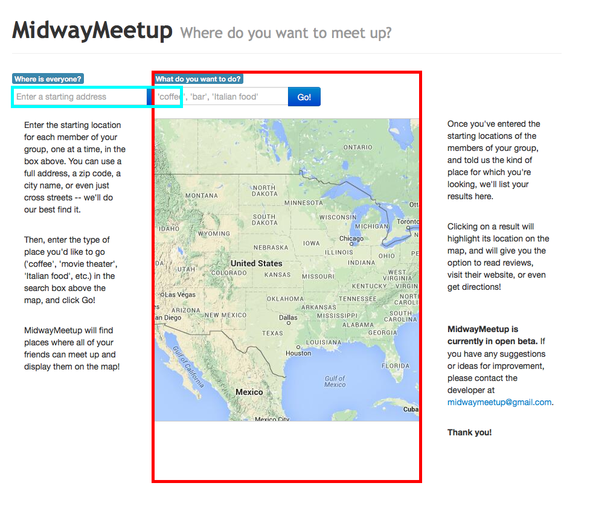
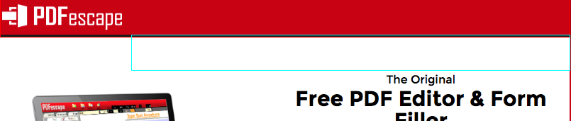
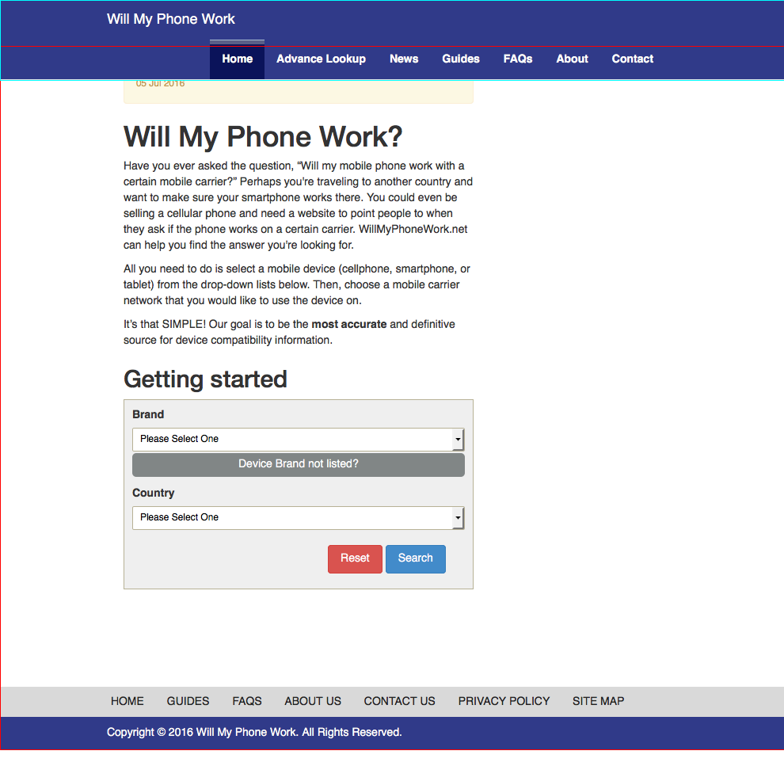

# Welcome to ReDeCheck!

ReDeCheck (REsponsive DEsign CHECKer, pronounced “Ready Check”) is an automated tool designed to aid developers during
the process of testing the layouts of responsive (i.e., "mobile ready") web sites. With the huge range of devices
currently available, performing adequate quality assurance on a sufficient range of devices is extremely difficult, if
not impossible. ReDeCheck extracts the layout of a web page at a wide variety of viewport widths, from smartphones to desktops, then analyses the layout behaviour found to detect common RWD layout issues, such as overlapping elements, elements overflowing their containers or the viewport, and incongruous wrapping elements. Since it is important to have a high-quality mobile-ready web site, ReDeCheck makes responsive web testing both efficient and effective!

## Installing Maven

The ReDeCheck project has been implemented using Maven, a build automation tool for projects programmed in the Java
programming language. If you wish to build the ReDeCheck tool from its source code, then you will first need to install
Maven on your workstation. If you have already installed Maven, then please go directly to the next section. Otherwise,
follow the installation guidelines at https://maven.apache.org/install.html.

## Downloading ReDeCheck

Clone the ReDeCheck project repository using either a graphical Git client or by running the following command at the
   prompt of your terminal window:

   `git clone https://github.com/redecheck/redecheck-tool.git`

## Installing ReDeCheck

As ReDeCheck has been implemented as a Maven project using the Java programming language, the easiest method of
generating the executable tool involves importing the project into an integrated development environment (IDE) and
generating the Java archive (JAR) from inside the IDE. Instructions are presented for doing this using two common IDEs:
Eclipse (https://www.eclipse.org/downloads/) and IntelliJ (https://www.jetbrains.com/idea/download/). However, if you
would prefer to build the project using the command line in an appropriate terminal emulator, then instructions to do so
are also provided.

#### Dependencies

The `pom.xml` file provided in the repository will handle the vast majority of dependencies needed for ReDeCheck to install and run correctly. However, before attempting to run ReDeCheck to test your websites, please ensure your setup is complete with the following requirements:

##### Java Version

ReDeCheck has been implemented to run using Java Development Kit (JDK) 7 or 8, which can be downloaded from
http://www.oracle.com/technetwork/java/javase/downloads/jdk7-downloads-1880260.html and
http://www.oracle.com/technetwork/java/javase/downloads/jdk8-downloads-2133151.html, respectively. Instead of
downloading the JDK from one of the aforementioned web sites, you can also use your operating system's package manager
to install it correctly. After downloading and installing the JDK, you are also likely to have to set Java 1.7 (or, Java
1.8) as the chosen Java Development Kit for the ReDeCheck project. Please follow the instructions provided by either
your operating system or your integrated development environments to accomplish this task.

##### Firefox

ReDeCheck uses the popular Mozilla Firefox web browser to render and analyse the web page under test. Currently, it has been tested on version 46, which is available at
https://ftp.mozilla.org/pub/firefox/releases/46.0/, for all major operating systems. Simply download and install the relevant version for your setup and ReDeCheck will handle the rest. There is no need to manually add Firefox into your `PATH` variable, as the tool will automatically find it on your workstation.

As there are a large number of options available, here is an example. To install on MacOS, first select `mac/` and then select your desired language (e.g. `en-GB` for English UK). Please be careful to not simply download the SDK (e.g. `firefox-46.0.mac-x86_64.sdk.tar.bz2`) as this will not provide you with an executable Firefox browser.

You may be able to use ReDeCheck with a more recent version of Firefox, but due to widely reported communication issues between Selenium and Firefox version 47 and later, there is a chance it may not execute correctly. If this is the case, using version 46 should solve the issue.

#### Installation with Eclipse

1. Select 'File' &rarr; 'Import'.
2. From the project options, select 'Maven' &rarr; 'Existing Maven Projects'.
3. Select the root directory of your downloaded copy of ReDeCheck.
4. Click 'Finish' to complete the import.
5. To generate the JAR file, select 'Run' &rarr; 'Run As' &rarr; 'maven install'.
6. A JAR file called `redecheck-jar-with-dependencies.jar` should have been created in the `target` directory of ReDeCheck's main directory; if this JAR file does not exist, then the installation with Eclipse failed and you will not yet be able to use ReDeCheck. Please try these steps again or, alternatively, try another IDE or the command-line-based approach.

#### Installation with IntelliJ

1. Select 'File' &rarr; 'Open'.
2. Navigate to the root directory of your installation of ReDeCheck.
3. Select the 'pom.xml' file and click 'Finish'.
4. Open the Maven Projects toolbar using 'View' &rarr; 'Tool Windows' &rarr; 'Maven Projects'.
5. Select the ReDeCheck project and click 'package'.
6. A JAR file called `redecheck-jar-with-dependencies.jar` should have been created in the `target` directory of ReDeCheck's main directory; if this JAR file does not exist, then the installation with IntelliJ failed and you will not yet be able to use ReDeCheck. Please try these steps again or, alternatively, try another IDE or the command-line-based approach.

#### Installation at the Command Line

1. Navigate to the root directory containing of your installation of ReDeCheck.
2. Type the following command to build the tool: `mvn package`
3. Maven will build the project from scratch, downloading all the required dependencies for the project automatically.
4. A JAR file called `redecheck-jar-with-dependencies.jar` should have been created in the `target` directory of ReDeCheck's main directory; if this JAR file does not exist, then the installation with the command line failed and you will not yet be able to use ReDeCheck. Please try these steps again or, alternatively, try one of the methods that uses an IDE.

## Running ReDeCheck

Once you have ReDeCheck correctly packaged and ready to run on your workstation, you have two options regarding the running of the tool:

1) Run ReDeCheck on a fully live site on the World Wide Web.
2) Run ReDeCheck on a local web page file.

Examples of how to run ReDeCheck in each configuration are shown below:

#### Running on a Live Site
Running ReDeCheck to test a live webpage is simple. Simply navigate into the `target` directory of your ReDeCheck installation (to make sure you're in the same directory as the executable .jar generated in the previous step) and run the following command:
```java -jar redecheck-jar-with-dependencies.jar --url http://conf.researchr.org/home/issta-2017```

The above command will render the home page of the ISSTA 2017 Conference.

##### The ReDeCheck RLF repository
To aid with any potential replication of our experimental results, we have made the entire collection of 26 web pages used in our experimental study available [here](https://github.com/redecheck/redecheck-rlf-examples). To run ReDeCheck on any of the provided web pages, follow the intructions below entitled "Running on a Local Page".

#### Running on a Local Page

Running ReDeCheck to test a local web page is simple. Simply navigate into the `target` directory of your ReDeCheck installation (to make sure you're in the same directory as the executable .jar generated in the previous step) and run the following command, which runs the Duolingo example from a local clone of the webpage repository:
```java -jar redecheck-jar-with-dependencies.jar --url Duolingo/index.html --preamble /Users/joebloggs/redecheck-rlf-examples/```

To explain how the various parameters are combined into a full local file path for ReDeCheck to use, we'll work through the above example.

| Parameter        | Description           |
| ------------- |-------------- |
| --preamble      | The root directory in which all your local website files are stored |
| --url | The directory containing the web page you want to test |

The full file path produced in this example is `Users/joebloggs/redecheck-rlf-examples/Duolingo/index.html`, so by simply changing any combination of these parameters you can test any local web page.

## Understanding ReDeCheck's Reports

After the tool has finished analysing a webpage for responsive layout failures, it produces a report and a series of highlighted screenshots, which will be saved in the `reports` directory of your ReDeCheck installation, with each report marked with a timestamp. To get the most out of ReDeCheck, it is important to learn how to interpret these reports, thus making it as easy as is possible to locate and fix any detected problems.

As ReDeCheck is currently capable of detecting five different types of responsive layout failure, we'll present an example of each so you know what to expect when going through your own test reports.

#### Element Collision
Element collision failures occur when two elements that were not overlapping at wider widths begin to overlap as the viewport narrows. The two offending elements and the viewport widths at which the failure occurs are presented in the test report as follows:

```
ELEMENTS /HTML/BODY/DIV/DIV[2]/DIV/DIV[2] AND /HTML/BODY/DIV/DIV[2]/DIV/DIV/FORM/DIV ARE OVERLAPPING BETWEEN 768 AND 1132
```

The two offending elements are also highlighted in a screenshot which accompanies the test report. Subdirectories named `faultXXX` where XXX is the number of the failure in the report contain the relevant screenshot. The screenshot for the above failure is shown below:


#### Element Protrusion
Element protrusion failures occur when a container is no longer wide enough to fit all of its contents, so elements spill out into surrounding parts of the page. A failure report for this failure type is shown below:

```
/HTML/BODY/DIV[3]/DIV/DIV[2] OVERFLOWED ITS PARENT BETWEEN 801 AND 805
/HTML/BODY/DIV[3] , /HTML/BODY/DIV[3]/DIV/DIV[2] , SIBLING , 801 , 805 ,  {aboverightAlignoverlapping}
```



Here we see an element (blue) reported as overflowing its parent (red) between 801px and 805px.


#### Viewport Protrusion
An extension of element protrusion, this failure type occurs when part or all of an element is pushed outside of the viewable portion of the page. They are reported as follows:

```
/HTML/BODY/DIV[2] overflowed the viewport window between 415 and 767
```


Here we can clearly see the main content container (highlighted in red) overflowing the viewport window (highlighted in green), meaning everything to the right of the green vertical line will be unviewable to the user.

#### Small-Range Layouts
When developers make mistake in how their media queries turn on and off as the viewport resizes, weird layouts can be observed for a small number of viewport widths. An example is shown below:
```
SMALL RANGE ERROR:
	THIS: /HTML/BODY/DIV , /HTML/BODY/NAV , SIBLING , 990 , 991 ,  {belowleftAlignrightAlignxMidAlignoverlapping}
	PREV: /HTML/BODY/DIV , /HTML/BODY/NAV , SIBLING , 320 , 989 ,  {belowleftAlignrightAlignxMidAlign}
	NEXT: /HTML/BODY/DIV , /HTML/BODY/NAV , SIBLING , 992 , 1400 ,  {belowleftAlignrightAlignxMidAlign}
```


Here we can see that for two viewport widths (990-991px), the header navigation links are displayed on a new line in the navbar (highlighted in blue), which in turn causes the header to overlap with the main content of the page (highlighted in red).

#### Wrapping elements
The final type of failure currently detected by ReDeCheck occurs when an element is no longer wide enough to render it's contents in a single row, so one element wraps onto a new line below. Below is an example:
```
WRAPPING ELEMENT ERROR FOR RANGE 456 -> 514:
	/HTML/BODY/DIV/DIV/FORM/BUTTON wrapped from row
	[ /HTML/BODY/DIV/DIV/FORM/INPUT /HTML/BODY/DIV/DIV/FORM/LABEL /HTML/BODY/DIV/DIV/FORM/BUTTON ]
```


The above example shows how as the viewport narrows, the form is not wide enough to render its three components side by side in a row, so the `BUTTON` (highlighted in red) wraps onto a new line.

## Building and Execution Environment

All of the previous instructions for building, installing, and using ReDeCheck have been tested on MacOS 10.12 "Sierra" and Ubuntu Linux 15.04 "Vivid Vervet". All of the development and testing on the Mac OS X workstations was done
with Java Standard Edition 1.7, while the same work was done with Java Standard Edition 1.8 on the Ubuntu workstation. While
ReDeCheck is very likely to work on other Unix-based development environments, we cannot guarantee correct results for
systems different than the ones mentioned previously. Currently, we do not provide full support for the building,
installation, and use of ReDeCheck on Windows; forks and pull requests that provide this functionality are welcomed.

## Problems or Praise?

If you have any problems with building, installing, or executing ReDeCheck, then please feel free to create an issue
associated with this Git repository using the "Issues" link at the top of this site. The contributors to the
`redecheck-tool` repository will do all that they can to resolve your issue and ensure that the entire tool works
well in your development environment and for your web site. If you find that ReDeCheck works well, then we also
encourage you to "star" and "watch" the project!

Thank you for your interest in responsive web testing and the ReDeCheck tool!
